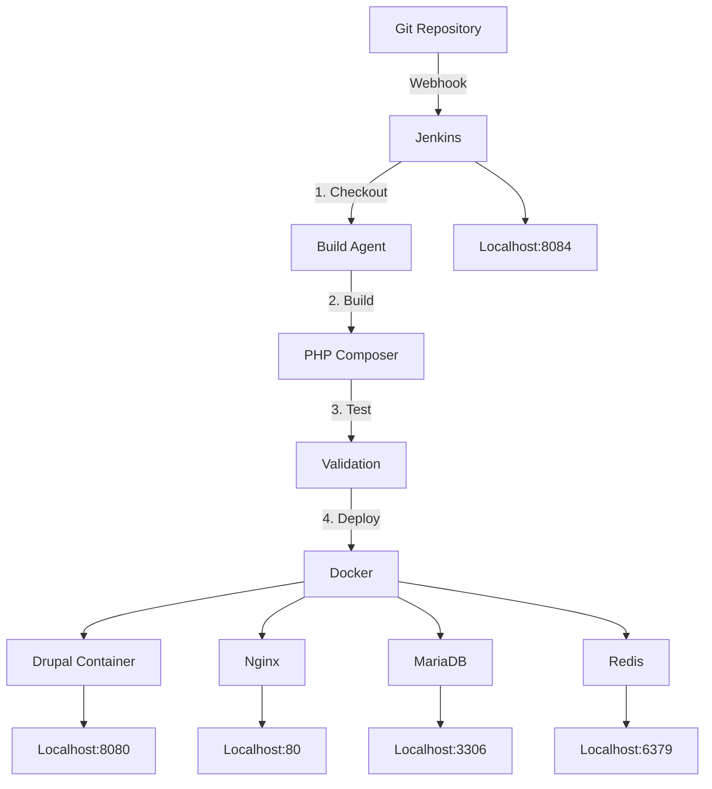

# 📋 RÉSUMÉ DE DÉPLOIEMENT - Drupal + Jenkins CI/CD

## ✅ Tâches Complétées

### 1. **Pipeline Jenkins (Jenkinsfile)**

Pipeline déclaratif complet avec 7 stages:

```
Checkout → Prepare → Install Deps → Build → Tests → Deploy → Post-Deploy
```

- Paramètres: ENVIRONMENT (develop/staging/production), RUN_TESTS, CLEAR_CACHE
- Déploiement automatique sur branche main
- Build reports et logs

### 2. **Orchestration Docker Compose**

7 services orchestrés:

- **Drupal** (PHP-FPM 8.3) - localhost:8080
- **Nginx** - Reverse proxy avec cache
- **Jenkins** - CI/CD - localhost:8084
- **MariaDB** - Base de données
- **Redis** - Cache distribuée
- **MailHog** - Mail testing
- Tous avec health checks et restart policies

### 3. **Scripts d'Automatisation**

- `build.sh` - Composer install + validation
- `deploy.sh` - Déploiement SSH avec backup automatique
- `test.sh` - Tests PHP syntax + structure Drupal
- `start.sh` + `stop.sh` - Gestion Docker Compose

### 4. **Configuration d'Environnement**

- `.env.example` - 20+ variables (DB, Redis, Mail, Drupal, Jenkins)
- `example.settings.local.php` - Configuration Drupal complète
- Support Redis, Mail configuration, trusted hosts

### 5. **Documentation Exhaustive**

- **DEPLOYMENT.md** (200+ lignes) - Guide complet avec troubleshooting
- **SETUP_GUIDE.md** - Architecture et fichiers créés
- **QUICK_START.sh** - Guide interactif
- Commandes utiles et checklist déploiement

---

## 🎯 ARCHITECTURE



---

## 📦 FICHIERS CRÉÉS (17 fichiers)

### Pipeline & CI/CD

- ✅ `Jenkinsfile` - Pipeline Jenkins déclaratif
- ✅ `jenkins/Dockerfile` - Image Jenkins avec outils
- ✅ `jenkins/plugins.txt` - 24+ plugins essentiels

### Docker & Services

- ✅ `docker-compose.yml` - Orchestration 7 services
- ✅ `docker-compose.override.yml` - Configuration dev
- ✅ `Dockerfile.drupal` - Image PHP-FPM 8.3
- ✅ `nginx.conf` - Configuration Nginx
- ✅ `default.conf` - Vhost Drupal
- ✅ `php.ini` - Configuration PHP optimisée

### Scripts

- ✅ `scripts/build.sh` - Build Drupal
- ✅ `scripts/deploy.sh` - Déploiement SSH
- ✅ `scripts/test.sh` - Tests validation
- ✅ `scripts/init-db.sql` - Init base de données
- ✅ `start.sh` - Démarrage services
- ✅ `stop.sh` - Arrêt services

### Configuration

- ✅ `.env.example` - Variables d'environnement
- ✅ `web/sites/default/example.settings.local.php` - Drupal config

### Documentation

- ✅ `DEPLOYMENT.md` - Guide complet (200+ lignes)
- ✅ `SETUP_GUIDE.md` - Architecture
- ✅ `QUICK_START.sh` - Guide interactif
- ✅ `SUMMARY.md` - Ce fichier

---

## 🚀 DÉMARRAGE EN 3 ÉTAPES

### 1️⃣ Configuration

```bash
cd /var/www/testjenkins/drupal
cp .env.example .env
nano .env  # Éditer mots de passe et configuration
```

### 2️⃣ Démarrage

```bash
./start.sh
# ou: docker compose up -d --build
```

### 3️⃣ Installation Drupal

```bash
docker compose exec drupal bash
cd /var/www/html
composer install
php vendor/bin/drush site:install standard -y
```

---

## 🌐 ACCÈS AUX SERVICES

| Service     | URL                   | Credentials            |
| ----------- | --------------------- | ---------------------- |
| **Drupal**  | http://localhost:8080 | Admin: admin/admin     |
| **Jenkins** | http://localhost:8084 | user: admin            |
| **MailHog** | http://localhost:8025 | -                      |
| **MariaDB** | localhost:3306        | drupal:drupal_password |
| **Redis**   | localhost:6379        | -                      |

---

## 🔧 COMMANDES ESSENTIELLES

### Drupal & Drush

```bash
docker compose exec drupal drush status
docker compose exec drupal drush cache:rebuild
docker compose exec drupal drush config:export
docker compose exec drupal drush config:import
```

### Jenkins

```bash
# Password initial
docker compose exec jenkins cat /var/jenkins_home/secrets/initialAdminPassword

# Logs
docker compose logs -f jenkins
```

### Logs Généraux

```bash
docker compose logs -f drupal
docker compose logs -f nginx
docker compose logs -f mariadb
```

### Gestion Services

```bash
docker compose ps
docker compose down -v  # Arrêter et supprimer volumes
docker compose restart drupal
```

---

## ✨ POINTS FORTS DE CETTE CONFIGURATION

✅ **Complètement Containerisée** - Docker/Compose
✅ **Pipeline Déclaratif** - Jenkinsfile complet
✅ **Multienv** - dev/staging/production en .env
✅ **Haute Disponibilité** - Health checks, restart policies
✅ **Optimisée** - Redis cache, OpCache, compression Nginx
✅ **Sécurisée** - Secrets en .env, permissions correctes
✅ **Scalable** - Facile d'ajouter services/agents
✅ **Documentée** - 4 guides + commentaires code
✅ **Prête Production** - Backups, migrations, logging

---

## 📝 PERSONNALISATION REQUISE

1. **`.env`** - Changer les mots de passe par défaut
2. **`DRUPAL_HASH_SALT`** - Générer un salt aléatoire
3. **`scripts/deploy.sh`** - Adapter le path de déploiement
4. **Jenkins Credentials** - Ajouter clés SSH pour déploiement
5. **HTTPS/SSL** - Configurer certificats pour production

---

## 🔐 SÉCURITÉ - Avant Production

```bash
# Générer un salt aléatoire
php -r "echo base64_encode(random_bytes(16));"

# Changer les mots de passe dans .env
# Générer clés SSH Jenkins
docker compose exec jenkins ssh-keygen -t rsa -N "" -f /var/jenkins_home/.ssh/id_rsa

# Configurer HTTPS
# - Obtenir certificat SSL
# - Mettre à jour Nginx config
# - Forcer HTTPS dans Drupal settings
```

---

## 📊 PIPELINE JENKINS - ÉTAPES DÉTAILLÉES

### Stage 1: Checkout

```groovy
// Clone le code depuis Git
// Récupère la version (git describe)
```

### Stage 2: Prepare

```bash
# Crée répertoires
# Vérifie fichiers essentiels
```

### Stage 3: Install Dependencies

```bash
composer install --prefer-dist --no-dev --optimize-autoloader
```

### Stage 4: Build

```bash
# Exécute scripts/build.sh
# Installation Composer complète
# Permissions fichiers
```

### Stage 5: Tests

```bash
# Validation syntaxe PHP
# Vérification structure Drupal
# Validation composer.json
```

### Stage 6: Deploy

```bash
# Déploiement SSH automatique
# Backup version précédente
# Rsync fichiers
```

### Stage 7: Post-Deploy

```bash
# drush updatedb (migrations)
# drush config:import (config)
# drush cache:rebuild
```

---

## 🆘 TROUBLESHOOTING RAPIDE

### Jenkins ne démarre pas

```bash
docker compose logs jenkins
docker compose restart jenkins
```

### Drupal inaccessible

```bash
docker compose ps
docker compose exec drupal drush status
docker compose exec mariadb mysql -u drupal -pdrupal drupal -e "SHOW TABLES;"
```

### Permissions erreurs

```bash
docker compose exec drupal chown -R www-data:www-data web/sites/default/files
chmod -R 755 web/sites/default/files
```

### Cache problématique

```bash
docker compose exec drupal drush cache:rebuild
docker compose exec redis redis-cli FLUSHALL
```

---

## 🎓 BONNES PRATIQUES APPLIQUÉES

1. **Infrastructure as Code** - Tout en fichiers git
2. **Configuration externe** - Secrets en .env
3. **Automatisation** - Scripts réutilisables
4. **Testing** - Validation à chaque build
5. **Logging** - Tous les services logués
6. **Monitoring** - Health checks partout
7. **Documentation** - 4 guides complets
8. **Scalabilité** - Architecture prête scale

---

## 📈 PROCHAINES ÉTAPES OPTIONNELLES

1. **Monitoring** - Ajouter Prometheus/Grafana
2. **Logging** - ELK Stack pour logs centralisés
3. **Backup** - Script backup BD automatique
4. **Agents Jenkins** - Ajouter agents pour scaling
5. **Notifications** - Slack/Email on build
6. **Artifact Repository** - Nexus/Artifactory
7. **Code Quality** - SonarQube integration
8. **Performance** - APM (DataDog, New Relic)

---

## ✅ CHECKLIST DÉPLOIEMENT FINAL

- [ ] Clone du projet
- [ ] Configuration .env personnalisée
- [ ] Docker Compose démarré
- [ ] Drupal installé via drush
- [ ] Jenkins configuré
- [ ] Pipeline créé et testé
- [ ] Credentials SSH ajoutées
- [ ] Build initial réussi
- [ ] Déploiement en staging OK
- [ ] Backups configurés
- [ ] Monitoring en place
- [ ] Alertes configurées
- [ ] SSL/HTTPS en production
- [ ] Documentation équipe
- [ ] Runbooks créés

---

**Configuration prête pour production! 🎉**

Pour plus de détails: Voir `DEPLOYMENT.md`
